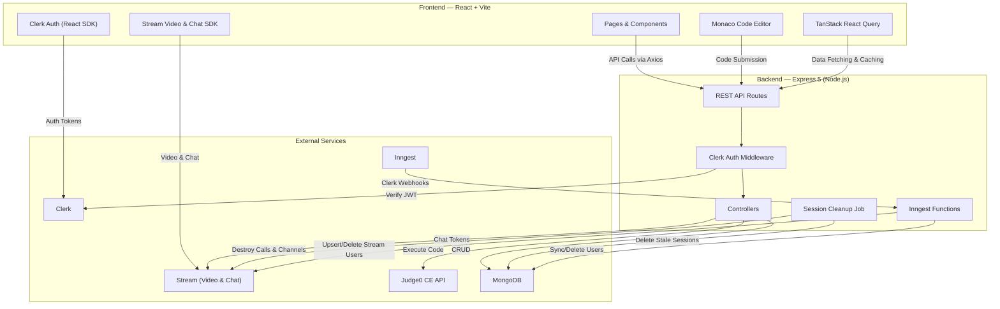

# CodeVerse

**CodeVerse** is a full-stack, LeetCode-like collaborative coding platform where users can solve DSA problems, write and execute code in multiple languages, and pair-program with others through real-time video calls and chat — all in one place.

---

## Features

- **Real-Time Video Calls** — Powered by Stream Video SDK for seamless pair-programming and collaborative problem-solving
- **Live Code Editor** — Monaco-based editor with multi-language support via Judge0 CE API
- **In-Session Chat** — Real-time messaging during collaborative sessions using Stream Chat SDK
- **DSA Problem Library** — Built-in coding problems with difficulty levels, constraints, and examples
- **Dashboard** — View active/recent sessions, stats cards, streak calendar, solved-problem progress, and create collaborative rooms
- **Authentication** — Secure auth powered by Clerk with middleware-protected routes
- **Event-Driven Architecture** — Inngest for background tasks like user sync and cleanup
- **Resizable Panels** — Flexible session layout with draggable panels for code, video, problems, and chat
- **Automatic Session Cleanup** — Background job that destroys stale, abandoned, or empty sessions
- **Confetti Celebrations** — Canvas-confetti effects for successful code submissions
- **Solved Progress Tracking** — Track your problem-solving progress across difficulty levels

---

## Tech Stack

| Layer      | Technology                                                                        |
|------------|-----------------------------------------------------------------------------------|
| Frontend   | React 19, Vite 7, Clerk, Stream Video/Chat SDK, Monaco Editor, Framer Motion     |
| Backend    | Node.js, Express 5, Mongoose, Stream Chat, Inngest                                |
| Database   | MongoDB (via Mongoose)                                                             |
| Auth       | Clerk (frontend + backend middleware)                                              |
| Code Exec  | Judge0 CE API                                                                      |
| Video/Chat | Stream (Video & Chat SDKs)                                                         |
| Styling    | Tailwind CSS 4 / DaisyUI 5                                                         |
| State      | TanStack React Query                                                               |

---

## System Architecture



### Architecture Overview

| Component | Responsibility |
|-----------|----------------|
| **React Frontend** | SPA with Clerk auth, Stream video/chat, Monaco editor, and TanStack Query for server-state management |
| **Express Backend** | REST API with Clerk middleware, session/code/chat controllers, and Inngest webhook handlers |
| **Inngest** | Event-driven functions that sync Clerk user lifecycle events (create/delete) to MongoDB & Stream |
| **Session Cleanup** | Periodic background job (every 30s) that destroys sessions with no participants, disconnected users, or heartbeat timeouts |
| **MongoDB** | Persistent store for User and Session models |
| **Stream** | Real-time video calling and in-session messaging |
| **Judge0 CE** | Sandboxed code execution engine supporting multiple programming languages |

---

## Environment Variables

### Backend (`backend/.env`)

```env
PORT=3000
DATABASE_URL=<your_mongodb_connection_string>
CLERK_PUBLISHABLE_KEY=<your_clerk_publishable_key>
CLERK_SECRET_KEY=<your_clerk_secret_key>
STREAM_API_KEY=<your_stream_api_key>
STREAM_API_SECRET=<your_stream_api_secret>
INNGEST_EVENT_KEY=<your_inngest_event_key>
CLIENT_URL=http://localhost:5173
```

### Frontend (`frontend/.env`)

```env
VITE_CLERK_PUBLISHABLE_KEY=<your_clerk_publishable_key>
VITE_API_BASE_URL=http://localhost:3000/api
VITE_STREAM_API_KEY=<your_stream_api_key>
```

---

## Getting Started

### Prerequisites

- **Node.js** (v18+)
- **MongoDB** (Atlas or local)
- **Clerk** account (for authentication)
- **Stream** account (for video & chat)
- **Judge0 CE** API access (for code execution)

### Installation

```bash
# Clone the repository
git clone https://github.com/your-username/Code_Verse.git
cd Code_Verse

# Install all dependencies (backend + frontend)
npm run build
```

### Running in Development

```bash
# Start the backend
cd backend
npm run dev

# In a separate terminal, start the frontend
cd frontend
npm run dev
```

- **Frontend** runs at: `http://localhost:5173`
- **Backend** runs at: `http://localhost:3000`

### Production Build

```bash
# From root directory
npm run build    # Installs deps & builds frontend
npm run start    # Starts the backend (serves frontend in production)
```

---

## API Endpoints

| Method | Endpoint                     | Description                       |
|--------|------------------------------|-----------------------------------|
| POST   | `/api/sessions`              | Create a new interview session    |
| GET    | `/api/sessions`              | List all sessions for the user    |
| GET    | `/api/sessions/:id`          | Get a specific session by ID      |
| PUT    | `/api/sessions/:id`          | Update a session (e.g., end it)   |
| POST   | `/api/code/execute`          | Execute code via Judge0 CE        |
| GET    | `/api/code/languages`        | Get supported programming languages |
| POST   | `/api/chat/token`            | Generate a Stream Chat token      |

> All routes (except public ones) are protected by Clerk authentication middleware.

---

## Key Pages

| Page            | Route             | Description                                                      |
|-----------------|--------------------|------------------------------------------------------------------|
| **Home**        | `/`                | Landing page with hero, features, how-it-works, stats, testimonials, and CTA sections |
| **Dashboard**   | `/dashboard`       | Manage sessions, view stats, streak calendar, solved progress, create new rooms |
| **Problems**    | `/problems`        | Browse DSA problems filtered by difficulty                       |
| **Problem**     | `/problem/:id`     | View a specific problem's details, constraints, and examples     |
| **Session**     | `/session/:id`     | Live interview room with video, code editor, chat, and problem   |

---

## Contributing

1. Fork the repository
2. Create your feature branch (`git checkout -b feature/amazing-feature`)
3. Commit your changes (`git commit -m 'Add amazing feature'`)
4. Push to the branch (`git push origin feature/amazing-feature`)
5. Open a Pull Request

---

## License

This project is open source and available under the [MIT License](LICENSE).
